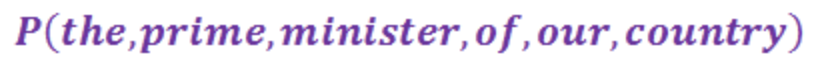
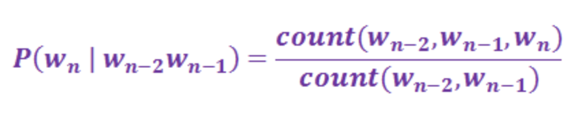
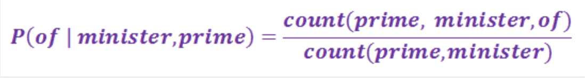
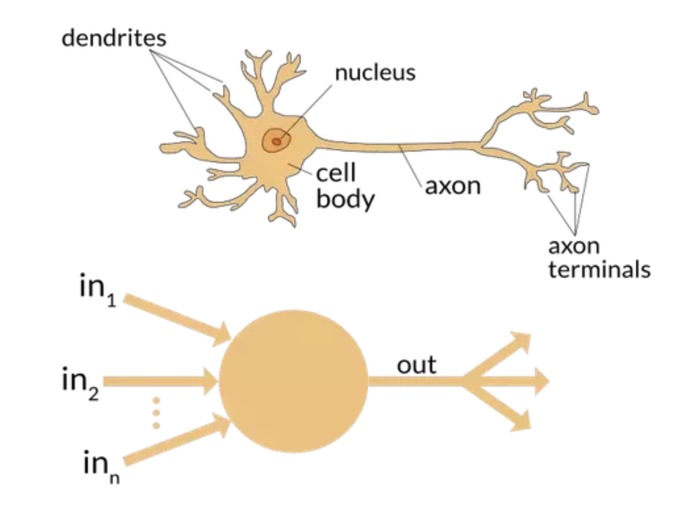
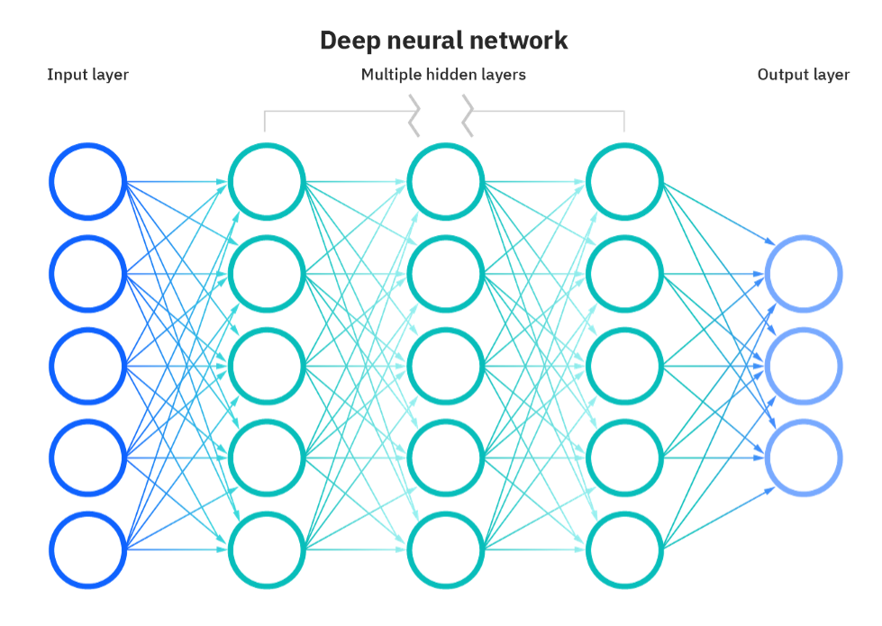

## An Overview on Language Models

Have you ever wondered how your phone knows what word you’re about to type before you actually type it? or how Gmail knows what you want to write in the email to your colleague? Are these devices reading our minds now? Fortunately, not yet. 

Our phones have technology embedded in them that uses probability distribution, also known as fancy math, on the words you have already typed to predict what word best fits your sentence. These are known as language models. Although it is a relatively new technology, many different kinds of language models have been created in the past few years. In this article, I intent to explore what language models are, how they work and how they have impacted the natural language processing (NLP) community.

As our devices get smarter, people, especially who’s not so familiar with computer science, might think that they are starting to gain actual abilities. What we need to keep in mind is that computers are dumb pieces of hardware, and are able to perform all the tasks that they do through mathematical computations. So, the first question we need to pose is “How do they work?”, "What's the math behind it?".
 
#### Probabilistic language models

Sentence completion language models can be created by simply using probability as portrayed in the images below. 
*Side note* Language models can be used for several different tasks such as question answering, speech recognition, sentence completion, grammar checkers, machine translation, etc. However, in order to explain probability based models, I will base my example on sentence completion. 

In this first image, we define our corpus (the words that compose our text).

This second image shows the equation that calculates the probability of one word (Wn) to be followed by another sequence of words (Wn-2 Wn-1).

 
Let’s put in some real words for it to make sense:

Images courtesy of [exploredatabase.com](https://www.exploredatabase.com/2020/04/bigram-trigram-and-ngram-language-model-in-nlp.html)

Following this probabilistic equation, we can calculate the probability of the word “of” following the word “prime minister”. This is the simpler approach for creating a language model. However, there’s several reasons why this is not the most accurate approach. As we can see, the probability of one word following another is solely based on the preceding n words we are considering. As the text gets more complex, the next word in a sentence might not be directly related to the previous n words making this method not very accurate. This approach is also not ideal performance wise because as the number n increases, the computation gets more expensive. 

#### Neural Networks
The probabilistic language model drawbacks take us toward a more complex but effective approach: neural networks. Simply put, neural networks are a mathematical representation of how human brains work, where each node in the network represents a neuron and each edge in the network represents an axon (refer to the image below). 

Image courtesy of [this github page](https://github.com/fastai/fastbook/blob/master/01_intro.ipynb)

The idea is that the network would be trained on a, usually large, dataset coming in from the input layer, going through a series of hidden layers, and then coming out from the last layer of the network, the output layer. While training, the network starts picking up on patterns, using threshold and weight values as guides, in the training dataset and learns to recognize them. By letting the network know when it gets the right answer and vice-versa, it starts correcting the wrong answers and improving its accuracy score (the percentage of correct answers). 
This is a very high-level description of how neural networks work but enough to understand the rest of this article. However, if you’re interested in learning more about them, start your studying by checking out [this post](https://www.ibm.com/cloud/learn/neural-networks).

Image courtesy of [ibm.com](https://www.ibm.com/cloud/learn/neural-networks).

Neural networks overcome the probabilistic model performance issues by being able to consider all the previous words when choosing the next word without impacting performance, especially when using recurrent neural networks. A recurrent neural network is just a special kind of neural network with a keen ability to remember sequences from the input they received, which is why they are mainly used to make predictions on what’s coming next in the sequence.
Although, recurrent neural networks reach state-of-the-art results in sentence completion tasks, there is another architecture used to create language models that exceeded everyone's expectations: transformers. 

#### Transformers 

Transformers made their way into the natural language community only a few years ago when Google published the [Attention is all you need](https://arxiv.org/abs/1706.03762) paper in 2017, and revolutionized the field. This approach overcomes the n-word dependency problem that the probabilistic approach had by using attention. Attention is rather complex mechanism used to provide context (by putting its attention on) for any position in the input data. For example, when we input a sentence, a transformer won’t process each word sequentially starting from the first word and ending on the last word, it will instead pay more attention to the words that confer more meaning to the overall sentence. This allows transformers to be parallelized (used multiple threads while executing) and therefore, making the trained time much faster than recurrent neural networks. As a consequence of the training time being shorter, transformers can be trained on a larger dataset than ever. A transformer architecture includes an _encoder_ which takes care of reading the input text and a _decoder_ which produces the prediction for the next word. 

Two of the leading pretrained transformer-based models are [BERT](https://arxiv.org/abs/1810.04805) and [GPT]( https://arxiv.org/abs/2005.14165). 

#### BERT
BERT stands for Bidirectional Encoder Representations from Transformers. The main difference between a normal transformer and BERT is that the second will ingest the data from both sides of each word. It looks at the input in a bidirectional way, which allows the models to learn the context of the words based on both left and right surroundings. The model was pre-trained on 2,500 million internet words and 800 million words of Book Corpus and achieved state-of-the-art performance on 11 natural language understanding tasks (check [this article](https://en.wikipedia.org/wiki/BERT_(language_model)) for details).

#### GPT
GPT stands for Generative Pre-trained Transformer. The GPT model was specifically created for text-generation tasks reached incredible state-of-the-art results for writing entire texts exactly like humans would do. The GPT model is trained on 175 billion parameters and is 10x more than previous models. It has reached extraordinary performances for tasks like machine translation, question answering, and unscrambling words. 

The NLP community has been completely revolutionized by these technologies achieving newest state-of-the-art results in all the main sub-fields. The GPT-3 models generates text that is difficult to distinguish from that written by a humans and the BERT model has introduced a whole new level of language understanding in machines thanks to its ability to interepret the meaning of a word considering both neighborinig words. We'll soon see new, more performant architectures, however until then, transformers will keep pushing the NLP known limits. 

My hope is that this article served as a good introduction to language models to people who don’t have a thorough computer science background. I tried to keep it simple while exploring complex machine learning concepts. We went over what language models are and what some of their architectures look like. Finally, we briefly explained how these newest technologies transformed the NLP community. 

### References 

Here’s the list of the wonderfully helpful articles I used as sources for my own. 
- [A beginner’s guide to language models](https://towardsdatascience.com/the-beginners-guide-to-language-models-aa47165b57f9),
- [BERT language model](https://www.techtarget.com/searchenterpriseai/definition/BERT-language-model),
- [10 Leading Language Models For NLP In 2021](https://www.topbots.com/leading-nlp-language-models-2020/)
- [Implement n-gram counting](https://www.ee.columbia.edu/~stanchen/e6884/labs/lab3/x43.html)
- [Neural Networks](https://www.ibm.com/cloud/learn/neural-networks)
- [Transformers](https://towardsdatascience.com/transformers-89034557de14)
- [BERT Explained](https://towardsdatascience.com/bert-explained-state-of-the-art-language-model-for-nlp-f8b21a9b6270)
- [BERT vs. GPT for NLP tasks](https://analyticsindiamag.com/gpt-3-vs-bert-for-nlp-tasks/)
